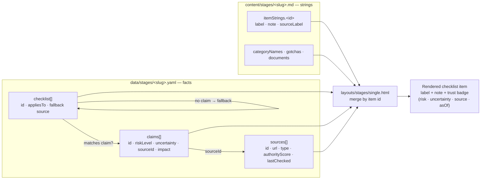
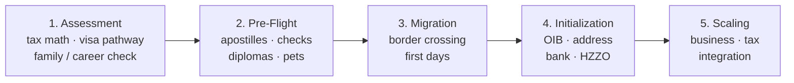
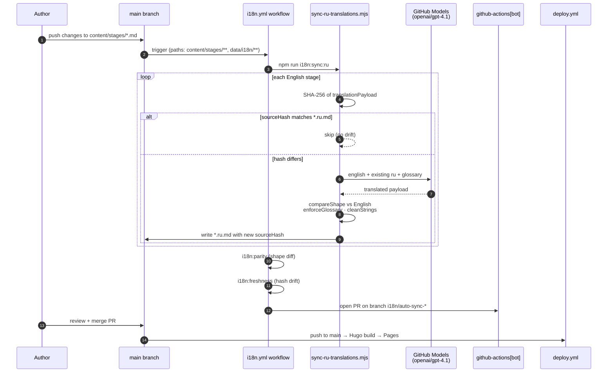
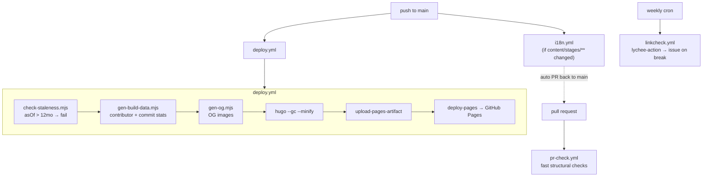

# ohmoveagain

**ohmoveagain** is an open-source relocation guide for moving to Croatia.

The core product is **the Pipeline** — a five-stage, source-linked framework that helps people plan, execute, and track a relocation with less guesswork. It combines ordered stages, prerequisites, required documents, practical checklists, and a runway calculator.

> Think of the Pipeline as CI/CD for relocation: ordered stages, explicit prerequisites, verifiable artifacts, and repeatable progress.

**Live site:** https://7nolikov.dev/ohmoveagain/

## Trust model

This project provides **source traceability**, not a guarantee of correctness.

Each checklist item includes:
- a source link
- a last verified date (`asOf` / `lastChecked`)
- where applicable, a trust badge summarising risk level, uncertainty, and source authority

Users should treat content as directional and verify critical steps with official sources (MUP, Porezna uprava, HZZO) before acting.

### How a trust badge is assembled



Two-track data: **structural facts** (URLs, dates, risk metadata) live in YAML and are language-neutral; **translatable strings** live in Markdown frontmatter keyed by item ID. A URL fix is a single YAML edit that propagates to every language. A translation is a strings-only change with zero drift surface.

### Source freshness

`scripts/check-staleness.mjs` runs on every build and inspects every `asOf` / `lastChecked` date in `data/`:
- **>6 months old** → warning
- **>12 months old** → build fails

Items can also declare `appliesTo: { visa, family, pets }` so the rendered checklist filters by persona — a digital-nomad applicant without dependents sees a different list than a Blue Card applicant moving with family and pets.

## What the project covers

Five sequential stages for relocation to Croatia:



Each stage answers four questions: what must be done first, which documents or artifacts are required, which official sources support the checklist, and which common mistakes usually slow people down.

User progress is stored in the browser (localStorage). No personal data is sent to a backend.

The site also ships a [runway calculator](https://7nolikov.dev/ohmoveagain/calculator/) that estimates how many extra months of savings a move buys, based on gross income and country-specific assumptions.

## Tech stack

| Layer | Tool |
| --- | --- |
| Static site generator | [Hugo](https://gohugo.io/) v0.160.1 extended |
| Client interactivity | [Alpine.js](https://alpinejs.dev/) v3 (SRI-pinned) |
| Form handling | [Formspree](https://formspree.io/) |
| Hosting | GitHub Pages |
| Deployment | GitHub Actions |
| Styling | Framework-free CSS |
| i18n sync | Node scripts + GitHub Models (`openai/gpt-4.1` by default, override via `GITHUB_MODELS_MODEL`) |

No application server, no database. Node is only used for CI-side i18n tooling — it is not required to render the site.

### Content Security Policy

The site ships `'unsafe-eval'` in `script-src`. This is required by the standard Alpine.js build (`alpine.min.js`). The CSP-compatible Alpine build (`alpine.csp.min.js`) was attempted and reverted twice — it is not stable with the current GitHub Pages + Hugo pipeline.

Mitigations in place: no user-supplied data reaches `eval`, no untrusted third-party scripts in `script-src`, Alpine is self-hosted and version-pinned in `static/js/`, Formspree is scoped to `form-action` only.

This trade-off is accepted and documented. Do not attempt to remove `unsafe-eval` without a fully-tested CSP-build of Alpine that survives the full deploy pipeline.

## Local development

### Prerequisites

- Hugo extended `0.160.1` or newer (`brew install hugo`)
- Node 20+ (only if you need to run i18n scripts locally)

### Run locally

```sh
hugo server -D
```

Live reload is enabled. Production build:

```sh
hugo --gc --minify
```

Output goes to `public/`.

### i18n scripts

```sh
npm install
npm run i18n:parity      # fail if per-language key shapes diverge
npm run i18n:freshness   # fail if any translated file has a stale sourceHash
GITHUB_TOKEN=... npm run i18n:sync:ru   # re-translate stale Russian files via GitHub Models
```

The sync script requires `GITHUB_TOKEN` with `models:read`. Locally this is a classic PAT; in CI the built-in token works. Running without stale files is a no-op.

## Project structure

```text
content/
  stages/                       # English stage content + frontmatter strings
    assessment.md               # canonical English
    assessment.ru.md            # auto-synced Russian (translationMeta.sourceHash)
    ...
  calculator.md
  contribute.md
  _index.md / _index.ru.md

data/
  countries.yaml                # calculator baseline data
  stages/                       # language-neutral structural data
    <slug>.yaml                 # trust layer: sources + claims + checklist + artifacts
  i18n/
    glossary.ru.json            # terminology pins for the translation model

i18n/
  en.yaml                       # UI strings (Hugo i18n)
  ru.yaml

layouts/
  _default/ stages/ partials/ shortcodes/

scripts/
  sync-ru-translations.mjs      # GitHub Models → content/stages/*.ru.md
  check-i18n-parity.mjs         # structural shape diff, en vs <lang>
  check-i18n-freshness.mjs      # sourceHash drift detector
  check-staleness.mjs           # warn >6mo, fail >12mo on data/**.asOf
  gen-build-data.mjs            # build-time contributor / commit stats
  gen-og.mjs                    # OG image generation
  i18n-lib.mjs                  # shared helpers (translationPayload, hash, shape compare)

static/                         # CSS, favicons, OG image
.github/workflows/              # deploy.yml, i18n.yml, linkcheck.yml, pr-check.yml
```

## Content model

The project separates **structural facts** from **translatable strings**.

**Structural facts** live in `data/stages/<slug>.yaml`:
- `sources` — URL, type (`official | supranational | community`), `authorityScore`, `lastChecked`
- `claims` — per-item trust metadata: `riskLevel`, `uncertainty`, `sourceId`, `impact`, `explanation`, optional `conflictNote`
- `checklist` — ordered categories and items, with optional `appliesTo: { visa, family, pets }` filters and fallback item-level `source: { url, asOf }` for items without a full trust claim

**Translatable strings** live in `content/stages/<slug>.md` frontmatter, keyed by item ID:
- `title`, `subtitle`, `description`, `duration`
- `categoryNames.<id>` — category display names
- `itemStrings.<id>` — `label`, `note`, `sourceLabel` per checklist item
- `gotchas[]` — common mistakes for the stage
- `requires[]`, `documents[]`, `artifactNames.<id>`

The template (`layouts/stages/single.html`) merges the two at build time via item ID lookup. A URL fix is a single YAML edit that propagates to every language; a translation is a strings-only change with zero drift surface.

> Current gap: trust-layer free-form strings (`impact`, `explanation`, `conflictNote` on claims) still live in the data YAML and render in English on `/ru/` pages. Tracked in `EXECUTION_PLAN.md` Sprint 8.

## i18n pipeline

English is canonical. Russian is auto-drafted by an LLM, validated mechanically, opened as a PR by a bot, and human-editable.



**Hashing:** each `content/stages/<slug>.md` has a canonical English payload (title, subtitle, description, requires, documents, categoryNames, itemStrings, gotchas, artifactNames, body) hashed with SHA-256 and stored as `translationMeta.sourceHash` on the translated file. Re-translation only fires when hashes diverge.

**Shape validation:** output is shape-validated against the English payload (`compareShape` in `scripts/i18n-lib.mjs`) — extra keys, missing keys, or array-length mismatches fail the build before anything is written.

**Glossary:** `data/i18n/glossary.ru.json` pins terminology (e.g. `Digital Nomad Visa` → `Виза цифрового кочевника`). The model is instructed to use glossary entries verbatim, and `enforceGlossary` re-applies them deterministically after the response.

**Tokens:** `REPO_TOKEN` (PAT, `repo` + `pull-requests`) is used to push the auto-sync branch and open the PR; `ACTIONS_TOKEN` (PAT with `models:read`) is the value passed as `GITHUB_TOKEN` to the sync script for GitHub Models access.

**Local guards:** `npm run i18n:parity` and `npm run i18n:freshness` reproduce the CI checks. Run them before pushing translation-affecting changes.

**Cost:** one stage is a single ~2k-token call. The full site re-syncs in seconds and only when content actually drifts.

## Configuration

Project-level settings live in `hugo.toml` under `[params]`:
- Formspree form ID
- Repository URL
- Open Graph image filename
- `baseURL` (update if the site domain changes)
- `[languages]` block enables `en` + `ru`

## Deployment



- `deploy.yml` — push to `main` builds with Hugo and publishes to GitHub Pages. Stale source dates fail the build before deploy.
- `i18n.yml` — runs when `content/stages/**` or `data/i18n/**` change; opens an auto-sync PR via `github-actions[bot]`.
- `pr-check.yml` — fast structural checks on pull requests.
- `linkcheck.yml` — weekly lychee-action; broken links auto-open an issue.

## Contributing

Contributions must prioritize accuracy and traceability. A good content PR:
- cites an official or authoritative source (prefer MUP, Porezna uprava, HZZO, EU Commission)
- is specific and actionable — avoids vague wording
- respects the current Croatia-first, developer-audience scope
- updates `asOf` / `lastChecked` dates when changing a source

Where to edit:
- `data/stages/<slug>.yaml` — source URLs, dates, IDs, filters, trust metadata
- `content/stages/<slug>.md` — labels, notes, gotchas, reader-facing text
- Never put URLs or dates in the `.md` files
- Never put human-readable strings in the `.yaml` files (except kebab-case `id`s)

For translation edits, edit the `<slug>.ru.md` file directly — the sync job only runs when the English hash changes, so hand-authored Russian tweaks survive until the English source next changes.

See `DECISIONS.md` for locked strategy decisions and `EXECUTION_PLAN.md` for current sprint work.

## License

MIT. See [LICENSE](./LICENSE).
